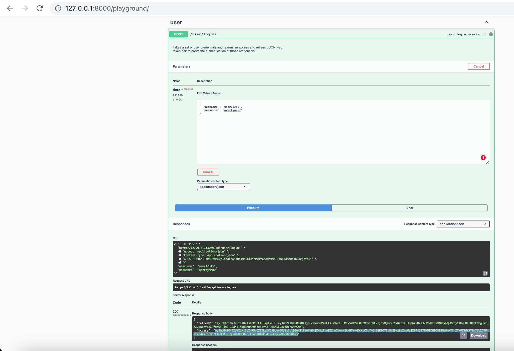
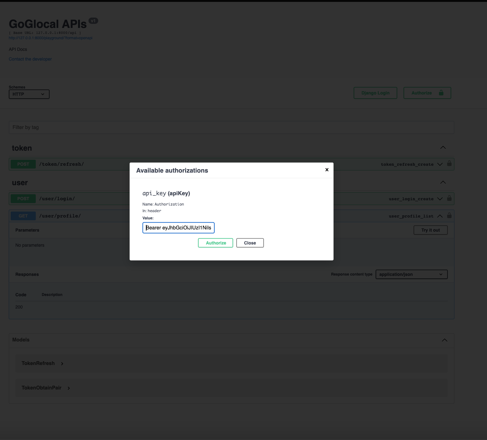
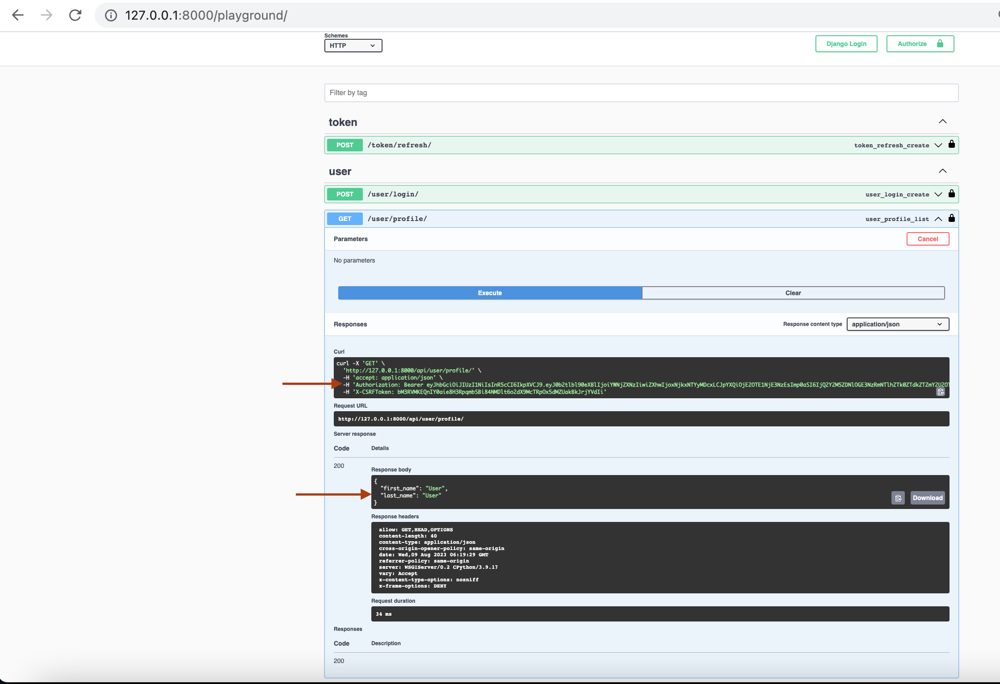

# Django Project with JWT Auth and Middleware Assignment

This repository contains the code for an assignment focusing on creating a Django project with JWT-based authentication and custom middleware. The assignment involves setting up a base Django project with a REST API using Django Rest Framework (DRF). It includes implementing JWT authentication, creating API endpoints, and developing a custom middleware to handle incoming requests.

## Table of Contents

- [Objective](#objective)
- [Specifications](#specifications)
- [Project Structure](#project-structure)
- [Setup Instructions](#setup-instructions)
- [Usage](#usage)
- [Endpoints](#endpoints)
- [Custom Middleware](#custom-middleware)
- [Optional](#optional)
- [Contributors](#contributors)
- [License](#license)

## Objective

The primary objective of this assignment is to create a Django project that incorporates JWT-based authentication, API endpoints, and a custom middleware. The assignment is divided into multiple parts, each focusing on a specific aspect of the project setup and development.

## Specifications

The assignment includes the following specifications:

- Setting up a new Django project and app using the standard project structure.
- Configuring Django Rest Framework (DRF) to develop API endpoints.
- Implementing JWT-based authentication using `djangorestframework-simplejwt`.
- Creating API endpoints for user login and user profile.
- Developing a custom middleware to handle incoming requests and attach user objects to requests.
- (Optional) Creating API endpoints for user CRUD operations.

## Project Structure

The project follows a standard Django project structure, with the following key components:

- `goGlocal`: The main project directory.
- `goGlocal`: An app within the project for implementing APIs and models.
- `swagger.py`: A custom schema generator for Swagger documentation.

## Setup Instructions

1. Clone the repository to your local machine:

   ```bash
   git clone https://github.com/sumitkj95/goGlocalAssessment
   cd <project_directory>

## Working APIs
#### Get Token


#### Provide Auth Key


#### Get User Details
